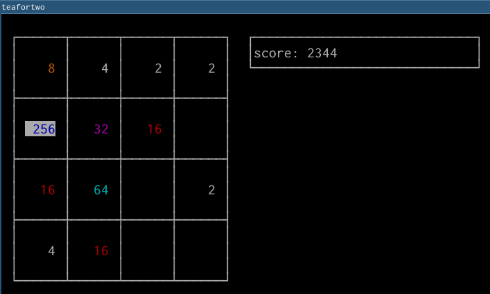

# teafortwo
[… and two for tea…](https://www.youtube.com/watch?v=pVUZl3ePfwg)

## What?
This is a CLI version of the [2048 game][1].  

## Why?
Insomnia. Also, I wanted to make an AI for 2048, making the actual game is the
first step.

## How?
This was made with Go, [gocui][2] to handle inputs, and [aurora][3] for colors.

[1]: https://gabrielecirulli.github.io/2048/
[2]: https://github.com/jroimartin/gocui
[3]: https://github.com/logrusorgru/aurora/
